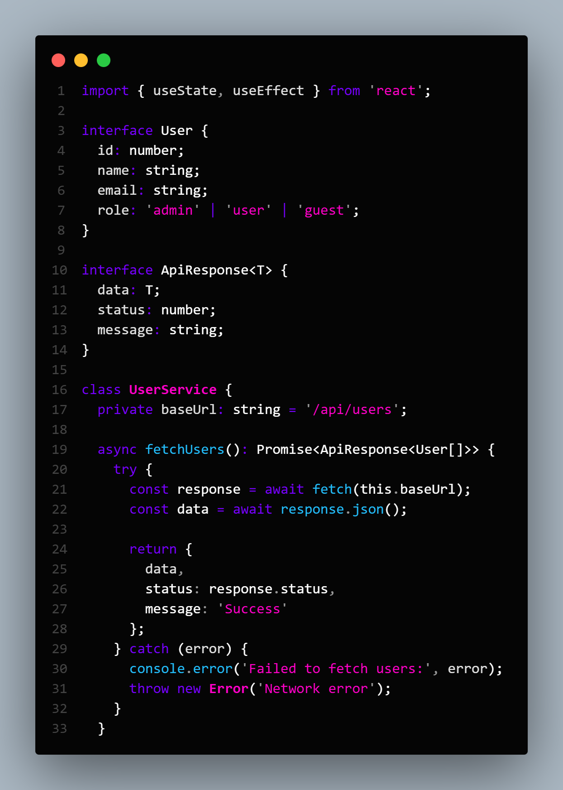

# Deep Dark Neon Theme

Custom dark theme for VS Code in the Neon style.

## Features

- Neon colors: pink, blue, purple
- Optimized for Next.js, TypeScript, Tailwind CSS
- Pleasant contrast for long-term development

## Installation

1. Download the archive and unpack
2. Press `win+r` and enter `%userprofile%`. There, find .vscode and drop the unpacked theme into the extensions folder.
3. Open VS Code
4. Press `Ctrl+K Ctrl+T`
5. Select `Dark Night`

## Screenshot

